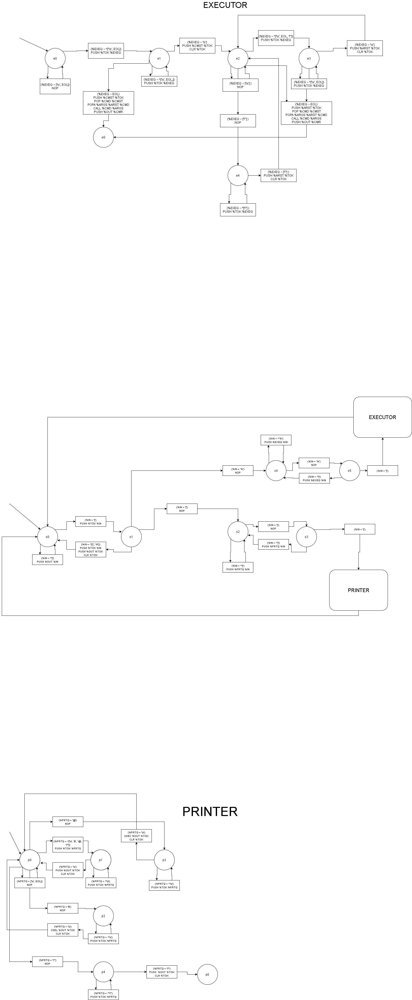

# Text-generating tools

## Grammar

Any text is valid TGT sequence. Anything enclosed between "{{" and "}}", or "" however have special parsing rules (microgrammar):

PRINT_STATEMENT := '{{' PRINT_EXPRESSION '}}'
PRINT_EXPRESSION := PRINT_TOKEN '\s' PRINT_EXPRESSION | PRINT_TOKEN
PRINT_TOKEN := '(\$|\@)?[A-Za-z0-9]+' | '\".*\"'

EXECUTE_STATEMENT := ''
EXECUTE_EXPRESSION := EXECUTE_COMMAND '\s' EXECUTE_ARGS | EXECUTE_COMMAND
EXECUTE_COMMAND := '(\$|\@)?[A-Za-z0-9]+'
EXECUTE_ARGS := EXECUTE_ARG '\s' EXECUTE_ARGS | EXECUTE_ARG
EXECUTE_ARG := '(\$|\@)?[A-Za-z0-9]+' | '\".*\"'

Commands and arguments prefixed with '$' are referred to local context, with '@' are referred to global context. 
Commands not starting with both symbols are referred as standart. Arguments not starting with both symbols
are just plain string literals.

## Registers

These registers are used in the diagram below to simplify representation of state machine flow:

%IN - input stream/current input character;
%OUT - output stream/current output character;
%TOK - current token stream;
%PRTQ - printing submachine stream/current printing submachine character;
%EXEQ - executing submachine stream/current executing submachine character;
%CMST - command stack;
%CMD - current command;
%ARST - arguments stack;
%ARGS - current arguments stream;
%CMR - current return result of command;

## Microcommands

PUSH %R1 %R2 - push value of R2 to R1 sequence;
CLR %R1 - reset register R1;
NOP - no operation;
USEL %R1 %R2 - push value of R2 using local context to R1 sequence;
USEC %R1 %R2 - push value of R2 using global context to R1 sequence;
POP %R1 %R2 - pop last value from R2 sequence to R1;
POPA %R1 %R2 %R3 - pop arguments from R2 to R1 according to command R3;
CALL %R1 %R2 - call command from R1 with values from R2;

## Diagram of state machine

<a href="https://viewer.diagrams.net/?highlight=0000ff&edit=_blank&layers=1&nav=1&title=CodeGen%20automata%20chart#R7V1de5s4Fv41fjpzkT5IID4uEyfT6W7apkn6bHvJxDTxrmO8NmmTvdjfvmAQBkkYBQPnqOuL6dgYbEVH79E57%2FnQxJ4%2BPr9bh6uHD%2FEsWkyoNXue2OcTSn3qp%2F9mF17yC9QLrPzK%2FXo%2By6%2BR3YWb%2BX%2Bi4iK%2F7Wk%2Biza1G5M4XiTzVf3iXbxcRndJ7Vq4Xsc%2F67d9jxf1X12F95F04eYuXMhX%2FzGfJQ%2F87%2FJ21%2F%2BM5vcP%2FJeJG%2BSfPIb85uIv2TyEs%2Fhn5ZJ9MbGn6zhO8lePz9NokU0en5f8uT8aPi0Hto6Wic4Dn%2BfR%2Bw25TsLFx7%2B577%2F9sOYkOXGLsSUv%2FA%2BOZunfX7yN18lDfB8vw8XF7urZOn5azqLsW6303e6eyzhepRdJevGfUZK8FMIMn5I4vfSQPC6KT6PnefK1eDx7%2Fa1y%2Ffy58sH5C3%2BzTNYv20feUsbff6t%2BuHtu%2B44%2FKE9SMW%2Bb%2BGl9F%2B2ZGb7YwvV9lOy5j%2BX3ZdNW%2BYFCBO%2Bi%2BDFKx5PesI4WYTL%2FUV9WYbE678v7dgJMXxQyfIU8OWxgBEoqArU0BVqT5lsGLs8Alzzz7%2F0RLp6KX9ooJLxYpOowk%2BTPh3kS3azC7Uz8TDVyXU7hZpXryO%2Fz50zezdP5I1on0fPeCeCfsmJAhYYndvH%2BZ0VdFpceKpqSX%2Bt9yqg0ZfKELWen2d6QvrtbhJvN%2FE5Yz%2BrV2XVttq45ornmKlPKFFPKr2kvzeIXruJ5OuJSok5doI4gqBxpxTPV%2FUb4GmLVv0cUeD4r0vdsZV7%2Bzd2XgQe6s7312Ot1IamuNjKYJmQ9r8pxNCFTwNpdpOM%2F%2Bx5vl92G247uv58ym%2BqM7F6mr%2B6z%2F%2F82oez9x%2FTm%2F6b%2FTdjFm4l39uZ3%2FkV%2Frfl9V19u%2FszuoOzTl9v8RfaYeBu%2Fkv5B%2BSD4ZWHl1ddVi5LuQyfbdeiVGK4oEEIVGkTEen%2F7mA0LxyoaNU3NGhqHtEx8XTxSVIAkoBoWs6mpLVAXSqDs8vb9y91n7%2BOMnrzb0GT19eGWG04YIGqqRLn%2BRAJRX9ozN0QWMqT34PjIvAeimCAgrVYiopUTsQRSpEKSNEBh%2B%2B4qWs%2FTWYvWB%2BMj0MSHjwoeQe8mZbs9efvp7%2BbZk7bgygXg5qQDuld1Q2ng%2B3WUut7IMOUWpGGuHx92v77fhJ1t4Tqh0y1yKXszYefdwavwGbf3i%2FdNL6%2F3fGqKCiC6OsAdTAcEBu7UYwUvXF2g49qR%2BbhH2JI%2FfroyB32uq%2BZkwTZgCmom4w4c6jqLFJezSBkafYrM%2B9eXqINKokTh%2FytIHkj%2FPxDNCgLs%2F1NgFqxL3Mh66xO7DgZ%2FbNeCKzPTLA4%2B7t7jSuf7eYCr69vP5hEBvkDXUQ%2FcEPFh8Yo5sERt3X3LQ4VJGzRYiNkS0ZaoTVFJlI%2B7aokohAyax0Q8wRSBDkVQ0ORM3AQHt7TbVZuNCwhO7%2BZGk61hFMFBLNruCIxsWYDyi8bGGLgtYZwj4B0dgUPw6kPj1Qblrzp5AqPZjba2d943JhtSjGl98YhBoobc4NP1Onyp3LbKbtg0%2FwxxCKv9EE83ac5ZPuR2bkHuVnE%2B4F7zmu12wqIEANdO2Qcnufo6TW9I19CzrLqurt9%2FvL24fr3GIeNoHDECWb6vaBxqKzSOtLr6UzmwaQidVM5YFjr3QNtdVVxhED7uESx0tJu7LYQby40cbHNnsDQfal%2FY1g724wJac6x%2FswqX3Teyi68X0y%2B3n6o7Wf6FaHayoG6VnNgK43nkrcwB3cq6kU1jWc%2BOrvXs4CKbnHZT8fVbGWXGk01iFOsEnmxy0BTia8ec6%2Fk0w5UrOroxDwdXKT6vxj1q1ENk2ns5foMnL5axn5T4H6le2VGEyBR7MmiIzJImCTpG5mAq8%2B4U%2Fx8OY7p13tisloEqvdWGy46IT90GI4l4odb7hCowObKzDlvsfSgih9z3dDNJGUWFSWZgKgI%2BmeKyTx1FdrAihAZqcNgONoODGVgfPJK9oVsE7OAK%2FPNxH1kSMSFOoknAy46YeXW%2FYzV1omZa%2B3zcY6fdGGrtE5%2FUMQmedsOAPfBO9TIjUZdM1wW3wToB7R33%2F3MM3JG4LvAgAQ%2F%2BHZD6w%2FpI%2FUmnMKlP%2BCZZx%2F%2BKpvEizhJIl%2FEyA%2Fn3%2BWIhXAoX8%2Ftl%2BvYuFUyWa3qWCWR%2BFy5Oiw8e57PZosnbqK%2BBHoTsiwlcqsJqRyFikRvuT8REEvFKEUeAdMrEjk2OIg9rVJfM7c2EKHJxc33FphvjbXgxj4fB6zCZdVgpXGrIBS5lP8GvcNjU5oqFha7bAleYrSYW1xJITCwXNuCPuT8xl1S7SHEltHmgOYqHl622Ng3sLlJPV6QeLnbCN6%2B6fLS4h7ZMfVzV5QFsXR%2FqPrfaMg3AOHxl6%2BIATXq4CShVT%2BFImVaBYFz7oqvRU%2B2XIxrxhefRVMsl3s%2FHNWgxF5fO0d1%2FxZwh6vtIcYVgPd20Sg9XKoIn5z4ezuDwFq8Zj1P2eHXKl45VvmTT3Zfp94DNf8oUJkiqVbWZJhU0WMkJD2WZs2mPxmp4uoEjrmWRANk3PD4%2FqCWmLVNcPrAnBwOPjG3rpPXWyLi2o9W2s4tPl%2BrN6hiiOEyJUVAlhpma5XgxzcDk4%2B7bwGyMEhpvL4qZtxhwiSYKpm9cyEfzuCP34%2FK1fUKKC7JD%2BIQaeP0VD%2B%2BQnD8H3vlTGUgiurWP6X1riQdg9XwCVn%2FoATnDl9i2IEjtU3zF451LAnekulj%2BcxjoPlxsn6%2FbadHvndo%2FDPq9dVqsaXbqGJ%2BuRcTgiAtudAWwzlAFfuhIOg6r9mAprjwVPu4qoaOQMiihI%2FbidhUdyEYldALgA6wRkwKBro2EbB8KDPQn61bucGS1tkwDXEce8XEfiR5tVSsa%2BB54%2F4gATzMsdN0GON4A6By1g2iL1MJA%2BTzi73hFa%2Bcmx7VpXIPm83DpjENafbm5uPx1SSvZGdI9cpYNpZiIdfSGGpe%2B9rkPFi53iFjm2YGjVTC%2FQqrIDEGZZFohO3HKlVh56KwFYhlIto7VZjvQ7fMUIKt3kCsu%2B7BJHMt4ulUKi8EfZ0msI8%2FUajiYhsBy4EdWQheaTDT%2BGfgRFMQCLtnt1OmG2n6dmrDGPhCutAzRUBZSTJuIFlVPnAUTw%2FCk5UApXoTVcP8wpEUpoNFYi%2Bmvy1o4Yr2Urau4%2BmAtlJV9zZuP7jkrNu3jnJVfp22QEJ08IYGCMx%2Bqb5C6ehN0a0LCSylnRlF1obwPV0EzASUaD%2B8l0UsA5CB5EjCWUTkcB02FOiizohaVIkVZPYm9%2B3XdzLpA1P88NNFYXC41E%2BzwhNfyhHgQgPjEwdbjPjxWrIsIWQW73MfYU6Q%2FD0W0KidNlQEpTpl28nMvIG3Fnm5Bzzj5zbJIxbTkrgnOJ6Q07%2FrPcFarP1DSHQvlt88o621xjrPXy4T7b7uO068u5AR2aIkrbSu6CUJ9FI%2BoEWP6YZXDmVK66pyAFZnvHfc%2BzGzbeWjhRkF%2F598EjCUx1y7dtlQRJxVzMByW0CTboaMOtP0Sgmv%2FoaAGBWbyQF%2BiYKnqe8dd9bKILGRIL0t2isG9LILpcEhchjXRptGQ2Qky3aC2EwQzIX1hlKXAZKtbdfiSylLoIwCu3lZMO9ZxREtB11HlRA8SOFFQDYnaUtCWKNjRPWruAY1rrA1SYgV1qVq0RazdM1QOkzXcGQINxCGiVtb7xX24cAbvSywdNeoM1%2Bli719aNfIVcQFIIz%2Bw0Bn5VOEHHbnAqg%2FbbuMjy32Q%2BxMINr5G3uv0w41%2Bchmwse8RCVWqUrdRaUEK28kVs%2B%2FMbXjTcMXHrROXYumnFtKIlC8Ff5URKRVcBsuxtEF3IdS%2BMdWlmiguztVG40lh8421JWrjIg9d4NqqLqc5jZWDpy1TZD4wVeSfIavzJQgT0Cies%2BrQpaNyRq99w0IW9pVbqurGRrqfgoIiWkIsKiLMV5XdjOpB2Qru5uhB1Sw94xDWykyoEWYWmOSMWG3%2FarDYYwDrX3WrvR1pv7K1k1rGotKlSgR%2FoALbXbcx6acaS2zbnhimTMKWM3heT2qeXptDahKxh2tq9frQezJDpEaweYCOotWTehItVJuyIxfTCMhKt%2BBDYgVXGeeZ33defUBx3ynH6bsbEbHbhyXEnl5eCt%2BdP6txPsX0wzU4yG1J0zMFxqmlwLgYXO0P45a0HqIbGfaY2luf7PYxKELABY73dNCMQzRD3kt5maYZ%2Bbi7a8YWg%2BOoGfd4UVJQlykwPq5qPPYv3eNh6po%2FgP1LG8YD2r%2B0hwyYAVX3K6QK1r9078Cr%2FUsVWzQmK4b40EaMkf1LR4OCLukK1z1x77h7705WCXeY3smUiN3uleGPodolNmDx2Mm01YQwDYuDdjLdj0fjW5pKB60EuodwDohRPPU%2F6PZLZd%2FShjtx1QAN19BTB6Ju%2BJiBZ%2FnXZrX9sppr%2Fgt1%2BmRip0%2BfMT08D9fp05JTQFYKkxjSa%2FDkaYP2GsixsLV5RenWxhHeshKLEoRtbIJ9b9MXK64UnHLk1fAOMmJErpKjinqekXXcMfK9Z3IsbUsPV0lPOfLWmp56bucEb3GPHBrVrYUbzqyC7TeHm8rg276B2KHt2Ll4BXywJnTKkCK6vWQGhBRwb6ZDETWodabfnQkbpDTaM3XAk1F5j5aUE0U9BTHQE9zSt%2Bs4m8jys3fpX%2FXwIZ5F2R3%2FAw%3D%3D"></a>

## Standart commands for executor

define X Y - define variable with X with value Y;

assign X Y - assing value Y to variable X;

prepend X - change output stream from document to variable X such that following text
will be added to beginning of X;

endprepend - change output stream back to document;

append X - change output stream from document to variable X such that following text
will be added to end of X;

endappend - change output stream back to document;

while X - change output stream to void if X is false, and push pointer of current
input position (before execution block) to stack;

endwhile - pop pointer of current input position from stack, and go back to it
if output stream is not void or change output stream back to previous
if outstream is void;

each X -  change output stream to void if X is empty, and push pointer of current
input position (before execution block) to stack;

endeach - pop pointer of current input position from stack, and go back to it
if output stream is not void or change output stream back to previous
if outstream is void;

noprint - change output stream to void;

endnoprint - change output stream to previous;

if X -  change output stream to void if X is false;

else - change output stream to void if outstream is not void, or change outstream
back to previous if outstream is void;

endif - change output stream back to previous if outstream is void;
